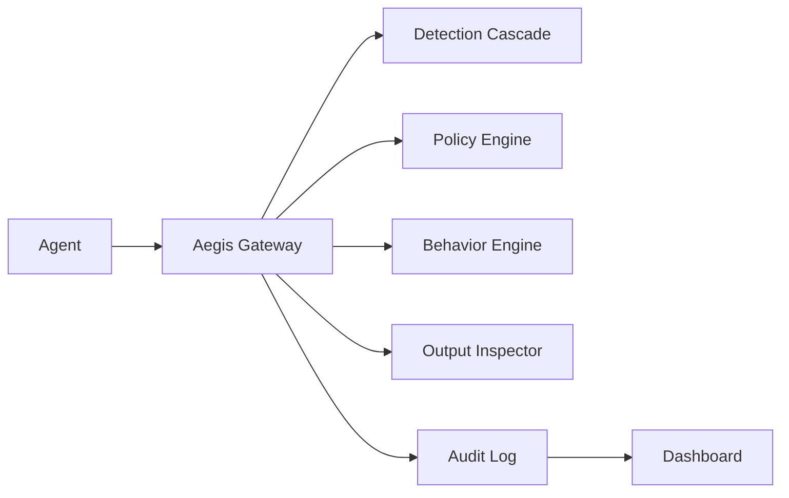

# GuardianAI Aegis Runtime


GuardianAI is a production-packaged security gateway for autonomous AI agents. It intercepts prompts, tool calls, and outputs, then returns measured decisions such as `ALLOW`, `BLOCK`, `KILL`, `REDACT`, or `REQUIRE_APPROVAL`.

## Quick Start
```bash
docker compose up --build
```

Open:
- Dashboard: `http://localhost`
- API docs: `http://localhost:8000/docs`
- Health: `http://localhost:8000/api/v1/health`

## Run Demos
```bash
python scripts/run_demo.py
```

## Run Benchmarks
```bash
python benchmarks/run_benchmarks.py
```

Outputs:
- `storage/reports/benchmark_report.json`
- `storage/reports/benchmark_report.csv`
- `storage/reports/benchmark_report_latest.csv`
- `storage/reports/benchmark_report.pdf`
- `assets/presentation/benchmark_throughput.svg`
- `assets/presentation/benchmark_p95_latency.svg`
- `assets/presentation/stage_latency.svg`

## What It Protects
- Direct prompt injection
- Semantic prompt injection
- Recursive tool abuse
- High-risk operations requiring approval
- Secret and credential leakage
- Suspicious behavior drift

## Architecture


## Production Packaging
The compose stack includes the FastAPI runtime, Nginx reverse proxy, health checks, automatic DB initialization/migration, persistent storage, backup/restore scripts, log rotation config, environment templates, and dev/prod configs.

## Final Assets
- Final documentation: `docs/final_documentation.md`
- Diagrams: `docs/diagrams.md`
- Demo video script: `docs/demo_video_script.md`
- OpenAPI: `storage/reports/openapi_spec.json`
- Postman collection: `examples/postman_collection.json`
- Presentation deck: `assets/presentation/GuardianAI_Final_Presentation.pptx`
